# パネットダッシュボード 業務フロー定義書

> 最終更新: 2026-03-30

---

## 目次

1. [認証](#1-認証)
2. [日報管理](#2-日報管理)
3. [日報承認](#3-日報承認)
4. [承認申請（汎用ワークフロー）](#4-承認申請汎用ワークフロー)
5. [期限延長申請](#5-期限延長申請)
6. [組織管理](#6-組織管理)
7. [店舗運営](#7-店舗運営)
8. [タス軽くん連携](#8-タス軽くん連携)
9. [パフォーマンス分析](#9-パフォーマンス分析)
10. [設定・監査](#10-設定監査)

---

## 1. 認証

### 1.1 ログイン

```mermaid
flowchart TD
    A[ユーザー] -->|メール・パスワード入力| B[POST /api/auth/callback]
    B --> C{認証成功?}
    C -->|Yes| D[Supabaseセッション発行]
    D --> E[/dashboard へリダイレクト]
    C -->|No| F[エラーメッセージ表示]
    F --> A
```

**アクター**: 全ユーザー
**前提条件**: アカウントが登録済み
**事後条件**: セッションCookieが発行され、ダッシュボードへ遷移

**正常系**:
1. `/login` 画面でメールアドレスとパスワードを入力
2. Supabase Auth で認証
3. セッションCookie発行
4. `/dashboard` へリダイレクト

**例外系**:
- メールアドレス未登録: エラー表示
- パスワード不一致: エラー表示
- アカウント無効（is_active=false）: ログイン後に制限

### 1.2 新規登録

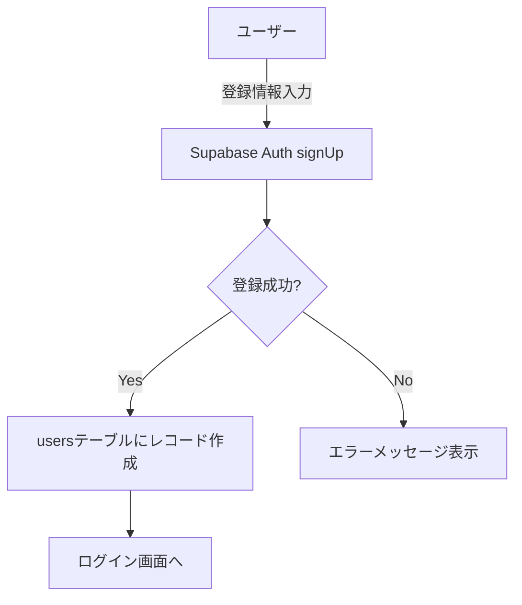

**アクター**: 未登録ユーザー
**正常系**:
1. 名前・メール・パスワードを入力
2. Supabase Auth でユーザー作成
3. `users` テーブルにプロフィール保存
4. ログイン画面へ遷移

**例外系**:
- 既存メールアドレス: 重複エラー
- パスワードポリシー不適合: バリデーションエラー

### 1.3 パスワードリセット

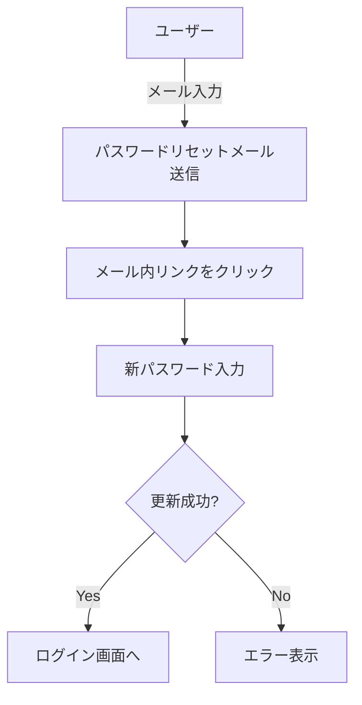

**アクター**: パスワードを忘れたユーザー

### 1.4 ミドルウェアによるルート保護

```mermaid
flowchart TD
    A[リクエスト] --> B{/dashboard/* ?}
    B -->|Yes| C{セッション有効?}
    C -->|Yes| D[ページ表示]
    C -->|No| E[/login へリダイレクト]
    B -->|No| F{/login ?}
    F -->|Yes| G{セッション有効?}
    G -->|Yes| H[/dashboard へリダイレクト]
    G -->|No| I[ログイン画面表示]
```

---

## 2. 日報管理

### 2.1 日報作成・提出フロー

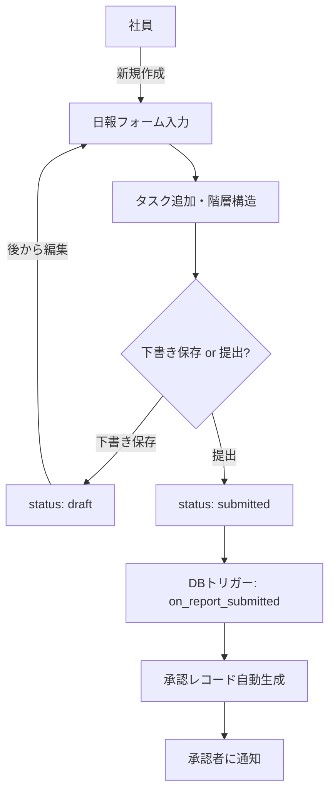

**アクター**: 社員（employee）、管理者（manager/admin）
**前提条件**: ログイン済み
**事後条件**: 日報が作成され、提出時に承認フローが開始

**正常系**:
1. `/dashboard/reports/new` で日報作成画面を開く
2. 日付・タイトル・業務内容を入力
3. タスクを追加（タイトル、見積時間、優先度、期限）
4. タスクの階層構造を設定（parent_task_id）
5. 下書き保存 or 提出
6. 提出時: DBトリガーで承認レコードが自動生成される

**例外系**:
- 必須フィールド未入力: バリデーションエラー
- 同日の日報が既に存在: 重複チェック

### 2.2 日報編集

**前提条件**: 日報のステータスが `draft` または `rejected`
**制約**: `submitted` / `approved` の日報は編集不可

1. `/dashboard/reports/[id]/edit` で編集画面を開く
2. 内容を修正
3. 下書き保存 or 再提出

### 2.3 タスク管理

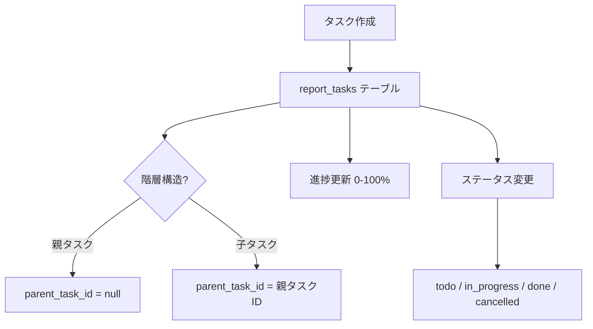

**タスクフィールド**:
- タイトル、説明、ステータス、優先度（high/medium/low）
- 見積時間、実績時間、進捗率（0-100）
- 開始日、期限日
- カテゴリ

### 2.4 日報コメント

**アクター**: 承認者・閲覧者
1. 日報詳細画面でコメントを入力
2. プライベートコメント（is_private=true）は承認者のみ閲覧可

### 2.5 閲覧追跡

1. 日報詳細画面を開くと `report_views` に記録
2. 閲覧者・閲覧日時を追跡

### 2.6 テンプレート

1. 管理者がレポートテンプレートを作成
2. 社員がテンプレートから新規日報を作成

### 2.7 タスク引き継ぎ（キャリーオーバー）

```mermaid
flowchart TD
    A[未完了タスク一覧取得] --> B[/api/reports/carry-over-tasks]
    B --> C[引き継ぎタスク選択]
    C --> D[新しい日報にタスクコピー]
```

1. 前日の未完了タスクを `/api/reports/carry-over-tasks` で取得
2. 引き継ぎたいタスクを選択
3. 新規日報にタスクをコピー

---

## 3. 日報承認

### 3.1 承認フロー

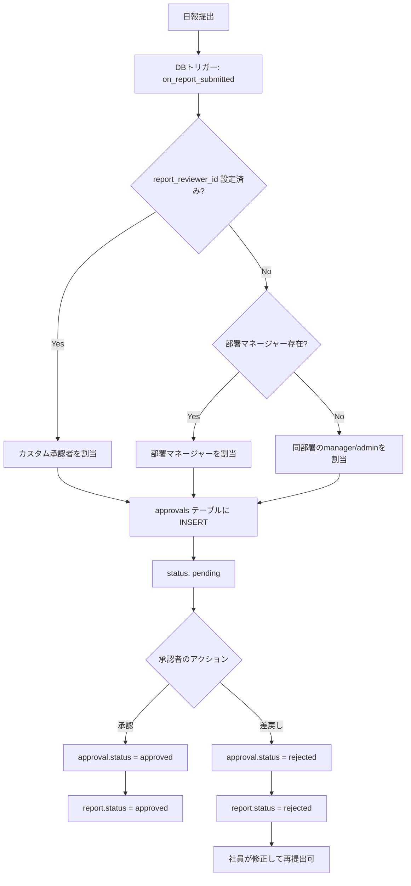

**アクター**: 管理者（manager/admin）
**前提条件**: 日報が提出済み（submitted）
**事後条件**: 日報が承認（approved）または差戻し（rejected）

**承認者割当ロジック（優先順）**:
1. ユーザーの `report_reviewer_id` に設定されたカスタム承認者
2. 所属部署の `manager_id`
3. 同部署で role が manager または admin のユーザー

### 3.2 承認統計

- 承認率（承認数 / 総提出数）
- 部署別提出率
- 平均承認所要時間

---

## 4. 承認申請（汎用ワークフロー）

### 4.1 申請作成・多段承認フロー

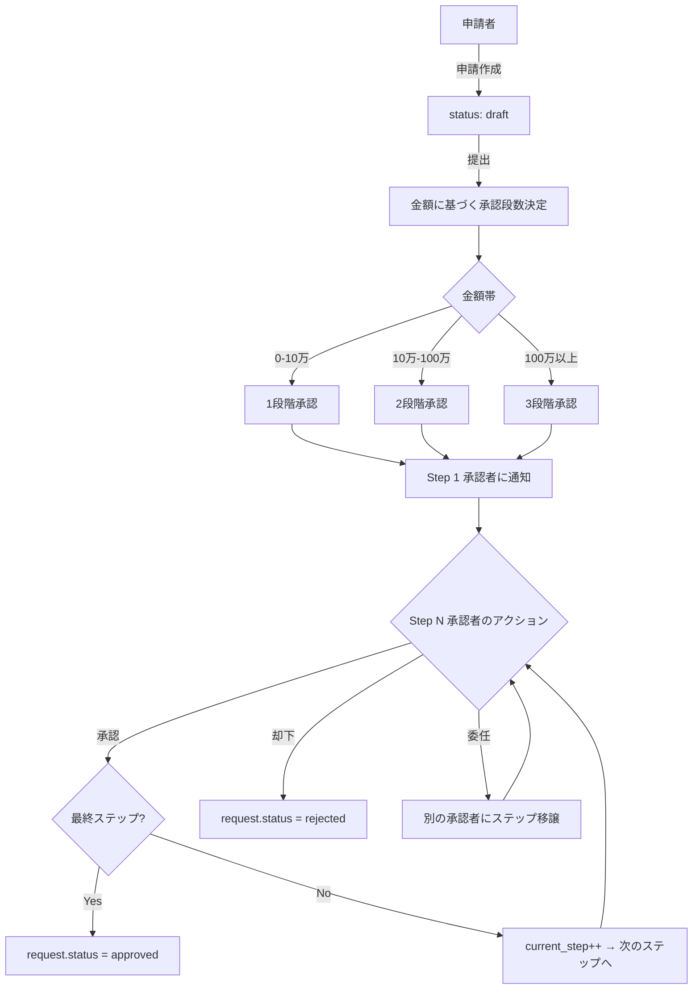

**アクター**: 全ロール（申請者）、manager/admin（承認者）
**前提条件**: ログイン済み

**申請カテゴリ**:
- `equipment_purchase`: 備品購入
- `document_review`: 書類確認
- `expense`: 経費
- `leave`: 休暇
- `other`: その他（カスタムカテゴリ名入力可）

**閾値ルール（approval_threshold_rules）**:

| 下限金額 | 上限金額 | 必要承認段数 |
|---------|---------|------------|
| 0 | 100,000 | 1 |
| 100,000 | 1,000,000 | 2 |
| 1,000,000 | - | 3 |

**正常系**:
1. `/dashboard/approval-requests/new` で申請作成
2. カテゴリ・タイトル・金額・詳細を入力
3. 下書き保存 or 提出
4. 提出時: 金額に応じた承認段数を自動決定
5. 各段階の承認者を選択
6. Step 1 の承認者に通知
7. 承認者が承認→次ステップ or 最終承認
8. 全ステップ承認完了→申請ステータス approved

**例外系**:
- 承認者が却下: 申請全体が rejected
- 承認者が委任: ステップの担当者が変更される
- 申請者がキャンセル: status = cancelled

### 4.2 添付ファイル

1. 申請にファイルを添付（URLまたはアップロード）
2. 添付は申請者のみ削除可

### 4.3 申請履歴

- 全アクション（作成・提出・承認・却下・委任・キャンセル）が `approval_request_history` に記録
- 監査証跡として利用

---

## 5. 期限延長申請

### 5.1 延長申請フロー

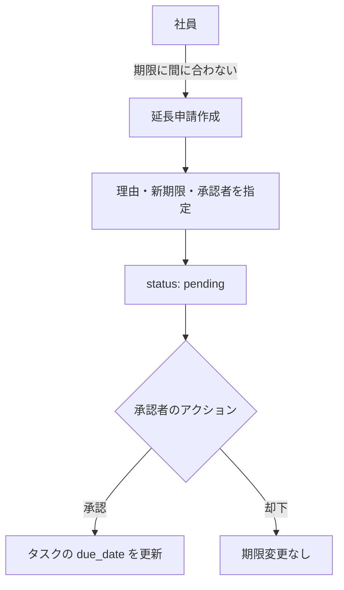

**アクター**: 社員（申請者）、manager/admin（承認者）
**前提条件**: 対象タスクに期限が設定されている

**正常系**:
1. タスクの期限延長を申請
2. 延長理由と希望期限を入力
3. 承認者を指定
4. 承認者が承認→タスクの期限が更新
5. 承認者が却下→期限変更なし

---

## 6. 組織管理

### 6.1 ユーザー管理フロー

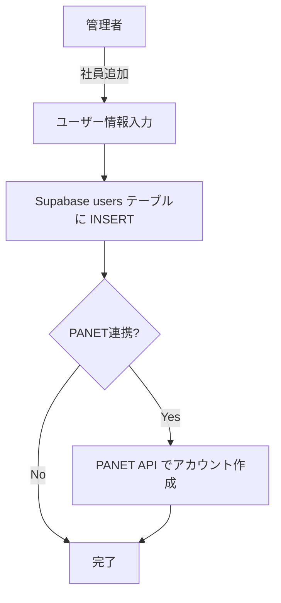

**アクター**: admin
**操作**:
- ユーザー一覧表示（フィルタ: 部署、事業所、ロール、検索）
- ユーザー追加（名前、メール、部署、事業所、ロール）
- ユーザー編集（プロフィール、ロール変更、承認者設定）
- ユーザー無効化（is_active=false）
- PANET一括連携（全アクティブユーザーをPANET APIに登録）

### 6.2 PANET一括連携

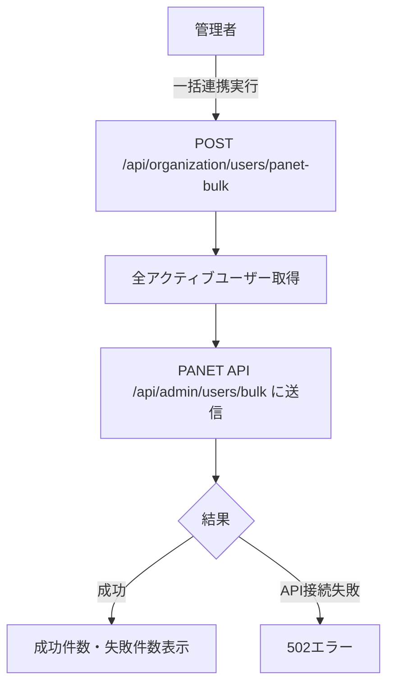

### 6.3 部署管理

- 部署CRUD（名前、マネージャー、親部署）
- 階層構造（parent_id）
- 組織図表示（`/dashboard/organization/chart`）

### 6.4 事業所管理

- 事業所CRUD（名前、住所、電話、メール、マネージャー）

### 6.5 権限管理

- ロール割当（admin/manager/employee）
- カスタム権限付与（user_permissions テーブル）
- 日報承認者のカスタム設定（report_reviewer_id）

---

## 7. 店舗運営

### 7.1 店舗管理

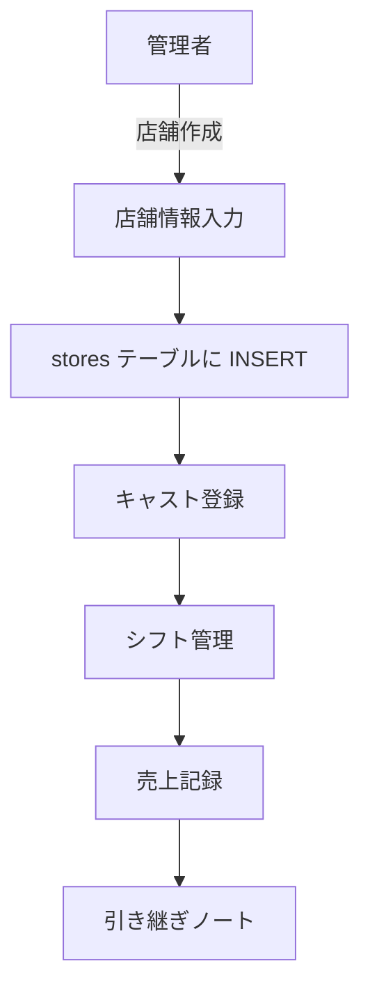

**アクター**: admin/manager

**店舗情報**:
- 名前、コード、グループ、エリア
- 住所、電話番号
- 営業時間、定員
- ステータス（active/suspended/closed）
- 担当マネージャー

### 7.2 キャスト管理

**操作**:
- キャスト一覧表示
- キャスト追加（名前、表示名、メール、電話、雇用形態、時給）
- キャスト編集・削除
- ステータス管理（active/inactive/suspended）

**雇用形態**: full_time / part_time / temporary

### 7.3 シフト管理

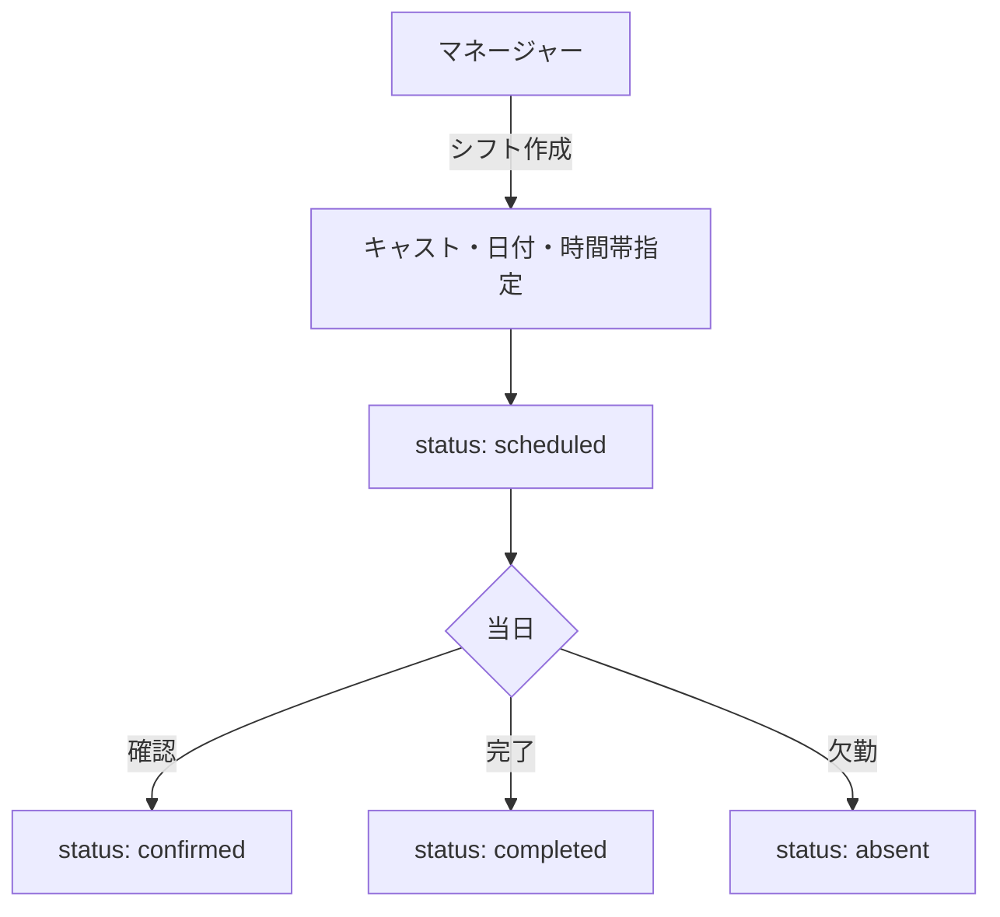

**シフトステータス**: scheduled → confirmed → completed / absent

### 7.4 売上記録

**操作**:
- 日次売上登録（売上種別、決済方法、金額、数量）
- 売上種別: drink / food / bottle / other
- 決済方法: cash / card / electronic
- 売上一覧・集計

### 7.5 引き継ぎノート

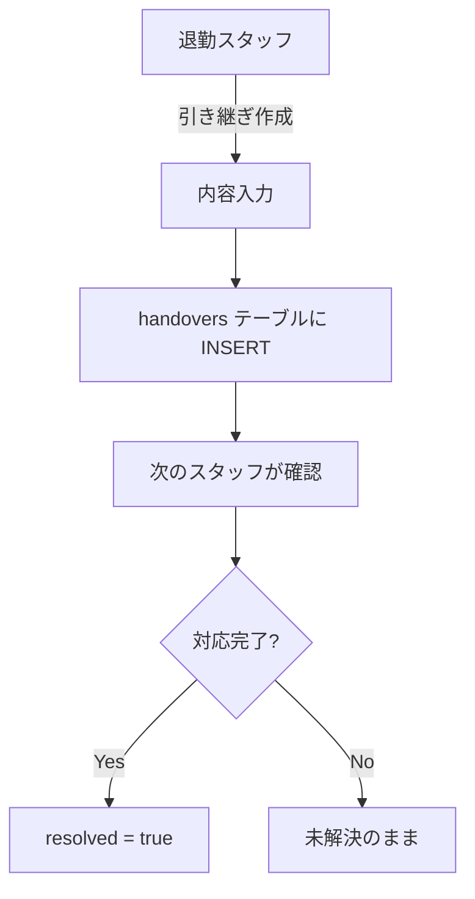

---

## 8. タス軽くん連携

### 8.1 Webhook受信フロー

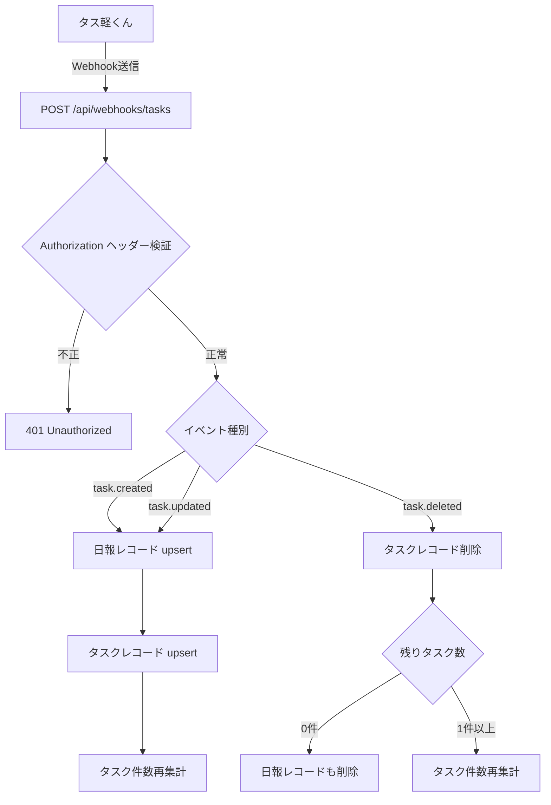

**アクター**: 外部システム（タス軽くん）
**認証**: Bearer トークン（WEBHOOK_SECRET）
**対象テーブル**: `store_daily_reports`, `store_daily_report_tasks`

**正常系 - task.created / task.updated**:
1. タス軽くんからWebhookリクエスト受信
2. Bearer トークンを検証
3. タスクの assignee・store 情報から日報レコードを upsert
4. タスクレコードを upsert（external_task_id で冪等性担保）
5. 該当日報のタスク件数・完了件数を再集計

**正常系 - task.deleted**:
1. external_task_id でタスクレコードを検索
2. タスクレコードを削除
3. 残りタスクが0件の場合、日報レコードも削除
4. 残りタスクがある場合、件数を再集計

**例外系**:
- 認証失敗: 401
- 不正なペイロード（event/task未設定）: 400
- 不明なイベント種別: 400
- DB操作エラー: 500

### 8.2 日報表示

- 店舗別日報一覧（`/dashboard/reports/store/[id]`）
- 「タス軽」バッジで外部連携データを識別
- タスク一覧・完了率の表示

---

## 9. パフォーマンス分析

### 9.1 分析フロー

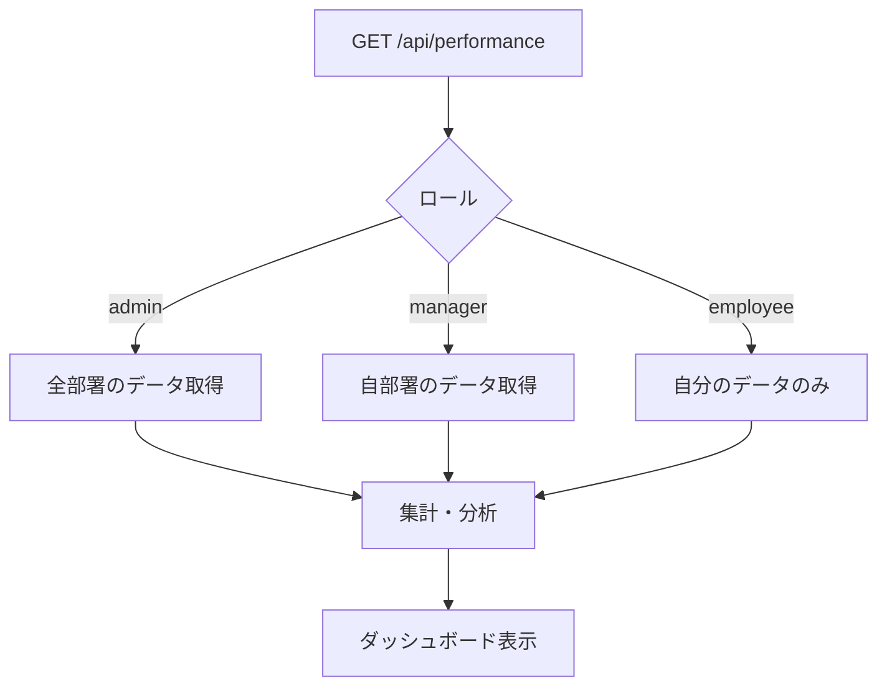

**メトリクス**:
- タスク完了率（完了数 / 総タスク数）
- 工数分析（見積時間 vs 実績時間）
- 優先度別タスク分布
- 期限遵守率
- 部署別パフォーマンス比較

**アクセス制御**:
- admin: 全部署・全ユーザー
- manager: 自部署のメンバー
- employee: 自分のデータのみ

---

## 10. 設定・監査

### 10.1 プロフィール設定

- 名前、メール、電話番号の変更
- パスワード変更

### 10.2 システム設定（admin専用）

**組織設定項目**:
- `report_deadline_hour`: 日報提出期限（時間）
- `report_require_title`: タイトル必須
- `report_require_work_hours`: 勤務時間必須
- `report_require_next_day_plan`: 翌日計画必須
- `approval_auto_assign`: 自動承認者割当
- `approval_deadline_days`: 承認期限（日数）
- `security_min_password_length`: パスワード最小文字数
- `security_session_timeout_hours`: セッションタイムアウト

### 10.3 監査ログ

```mermaid
flowchart TD
    A[全操作] --> B[audit_logs テーブル]
    B --> C[/dashboard/settings/audit-logs で閲覧]
    C --> D[フィルタ: ユーザー、アクション、日時]
```

**記録項目**: ユーザーID、アクション種別、対象リソース、変更内容、タイムスタンプ

---

## 付録: ロール別権限サマリー

| 機能 | employee | manager | admin |
|------|----------|---------|-------|
| 日報作成・編集 | 自分のみ | 自分のみ | 自分のみ |
| 日報閲覧 | 自分のみ | 部署+レビュー対象 | 全件 |
| 日報承認 | - | 割当分 | 割当分 |
| 承認申請 作成 | OK | OK | OK |
| 承認申請 承認 | - | OK | OK |
| ユーザー管理 | - | - | OK |
| 部署・事業所管理 | - | - | OK |
| 店舗管理 | - | OK | OK |
| システム設定 | - | - | OK |
| 監査ログ閲覧 | - | - | OK |
| パフォーマンス | 自分のみ | 部署 | 全件 |

---

## 付録: データフロー全体図

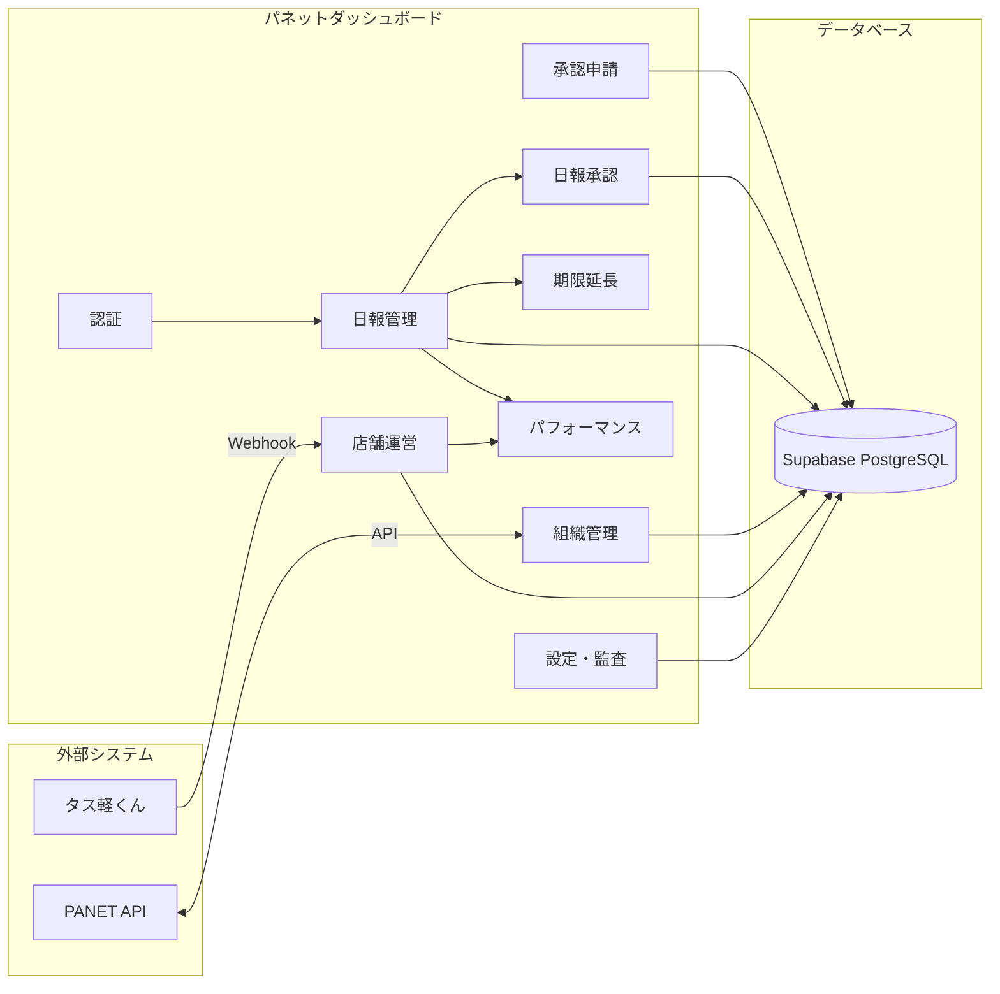
